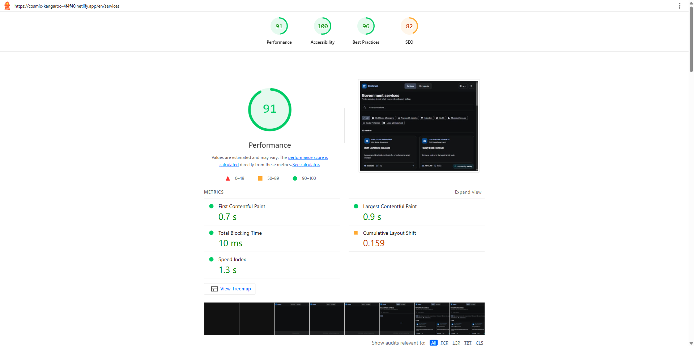
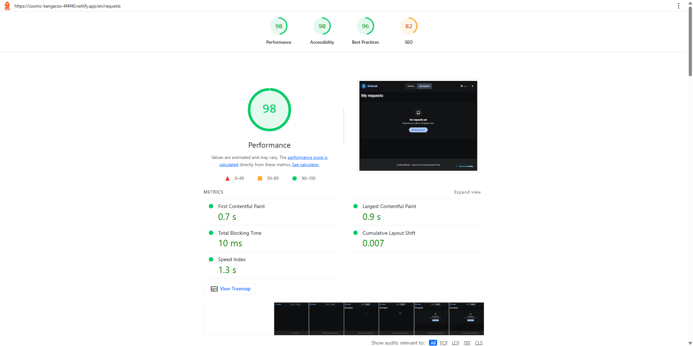
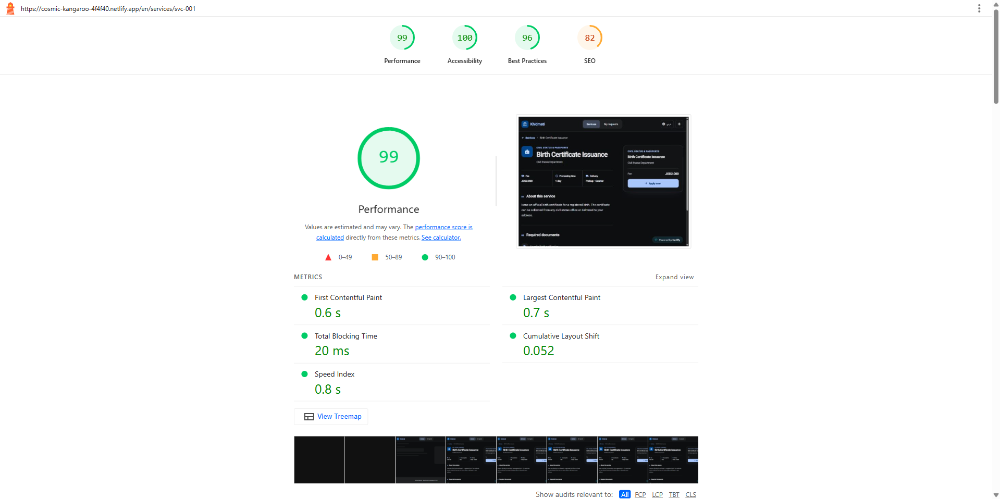
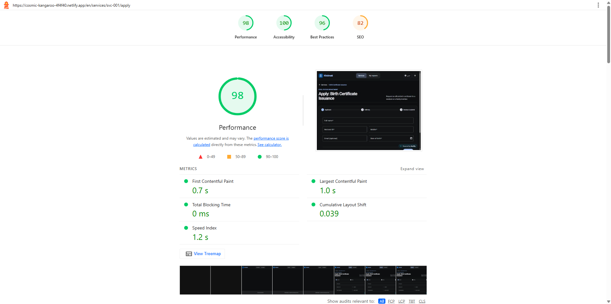

# Khidmati — Bilingual Government E-Services Portal

A take-home assessment build for Sanad: a bilingual (EN/AR, RTL-correct) mini
e-services portal. Citizens browse government services, read details, apply
through a three-step form, and track/cancel their requests. No backend —
`services.json` is loaded with `HttpClient`, submitted requests live in
`localStorage`.

## Running locally

Requires Node 20+ and npm.

```bash
npm install      # install dependencies
npm start        # ng serve → http://localhost:4200
npm test         # ng test → unit tests via Vitest
npm run build    # production build → dist/
```

No environment variables or backend needed — `services.json` is served as a
static asset from `public/data/`.

## Live URL

[https://khidmati-assessment.netlify.app/en/services](https://khidmati-assessment.netlify.app/en/services)

Deep links are deployed with SPA fallback support, for example:

- [https://khidmati-assessment.netlify.app/en/services/svc-001](https://khidmati-assessment.netlify.app/en/services/svc-001)
- [https://khidmati-assessment.netlify.app/en/services/svc-001/apply](https://khidmati-assessment.netlify.app/en/services/svc-001/apply)
- [https://khidmati-assessment.netlify.app/en/requests](https://khidmati-assessment.netlify.app/en/requests)

## Production Lighthouse results

| Page | Performance | Accessibility | Best Practices | SEO | Screenshot |
|---|---:|---:|---:|---:|---|
| Service catalog | 91 | 100 | 96 | 82 |  |
| My requests | 98 | 98 | 96 | 82 |  |
| Service details | 99 | 100 | 96 | 82 |  |
| Apply form | 98 | 100 | 96 | 82 |  |

## Structure & key decisions

```
src/app/
  core/         singleton services, guards, interceptor, models, validators (providedIn: 'root')
  layout/       app shell (header, nav, language switcher, footer)
  feature/      one folder per lazy-loaded route/screen (smart components)
  pattern/      reusable smart dialogs (confirm cancel, confirm leave)
  ui/           small presentational/dumb components (service card, empty state)
```

- **`core/i18n/I18nService`** — a hand-rolled, signal-based i18n service
  instead of ngx-translate/Transloco. `currentLang`/`translations` are
  signals, `currentDir`/`isRtl` are `computed()`, and an `effect()` keeps
  `<html lang>`/`<html dir>` in sync automatically. Translations are fetched
  with `HttpClient` and cached per language (`Map<Lang, Translations>`) so
  switching back to a previously-loaded language is instant. Chosen over a
  library to stay signal-native end-to-end and avoid an extra runtime
  dependency for two JSON files.
- **State management** — plain `signal()`/`computed()` inside singleton
  services (`ServicesDataService`, `RequestsService`, `I18nService`,
  `ThemeService`), no NgRx/Akita. `ServicesDataService` exposes `Map`-backed
  `computed()` lookups (`getServiceById`, `getCategoryById`,
  `getGovernorateById`) for O(1) access, and caches the in-flight HTTP
  request with `shareReplay(1)` so multiple consumers (catalog page, title
  strategy) share one network call. For 5 routes and 2 feature areas, a
  store library would have been pure ceremony.
- **Guards** — three functional guards: `languageGuard` (validates `:lang`,
  redirects unsupported values to `en` via `UrlTree` while preserving the
  rest of the path), `activeServiceGuard` (blocks `/apply` for an inactive
  or unknown service id, redirecting back to the details page), and
  `pendingChangesGuard` (bonus `canDeactivate`, warns before leaving a
  half-filled apply form). The deactivate guard just calls a
  `canDeactivate()` method the component implements — keeps the guard
  itself generic and reusable instead of reaching into form state.
- **`appHttpInterceptor`** — functional interceptor, adds `Accept-Language`
  to every request and, on error, opens a translated `MatSnackBar` and
  **re-throws**, so the calling page still renders its own error/retry
  state (matches the brief's DevTools "block services.json" test).
- **`RequestsService`** — all methods return `Observable`s
  (`of(...).pipe(delay(800))`) to simulate latency uniformly, backed by
  `localStorage` with try/catch guards. Swapping to a real API later only
  touches this one file.
- **Validators** (`core/validators/custom-validators.ts`) — small pure
  `ValidatorFn`s: national ID (10 digits), Jordanian mobile
  (`07[7-9]\d{7}`), minimum age 18 (month/day-aware), and appointment date
  (must be future, not Friday/Saturday).

### Bonus checklist

| # | Bonus requirement | Status | Current state |
|---:|---|---|---|
| 1 | Unit tests for validators, services, and components | Covered | 35 tests across 15 `.spec.ts` files using Angular's default unit-test builder with Vitest. |
| 2 | SSR (`ng new --ssr`) with browser-only APIs handled | Not covered | SSR was removed: no direct SSR dependency, no `main.server.ts`, no `server.ts`, and no SSR build target. |
| 3 | Signal Forms for the application form | Not covered | The apply form uses standard Angular Reactive Forms with `FormBuilder`, `FormGroup`, and `FormControl`. |
| 4 | Custom signal-based i18n service instead of a library | Covered | `I18nService` uses `signal()`, `computed()`, `effect()`, translation caching, and custom pipes. |
| 5 | Dark mode following system preference, toggle, theme tokens | Covered | `ThemeService` uses `prefers-color-scheme`, a header toggle, persistence, and Material theme tokens. |
| 6 | Lighthouse Accessibility >= 90 on catalog and apply pages | Covered | Catalog and apply both scored 100 Accessibility; screenshots are stored under `docs/lighthouse/`. |
| 7 | Search and category filters synced to URL query params | Covered | `CatalogPage` reads and writes `q` and `category` query params with `replaceUrl: true`. |
| 8 | Arabic-friendly search | Covered | `normalizeSearchText` strips Arabic diacritics and normalizes `أ/إ/آ`, `ة`, and `ى`. |
| 9 | `canDeactivate` warning before leaving a half-filled form | Covered | `pendingChangesGuard` protects `/apply` and opens `LeaveConfirmDialog` when the form is dirty. |
| 10 | Localized page titles with custom `TitleStrategy` | Covered | `CustomTitleStrategy` localizes route titles and dynamic service names. |

### Bonus items implemented

- Dark mode (`ThemeService`) — follows system preference on first load, manual
  toggle, persisted, driven by Material theme tokens.
- Arabic-friendly search (`core/utils/search-utils.ts`) — strips diacritics,
  folds `أ/إ/آ → ا`, `ة → ه`, `ى → ي` before matching.
- Search and category filters are synced to URL query params (`q` and
  `category`) and restored on refresh.
- `canDeactivate` guard on the apply form (see above).
- Custom `TitleStrategy` (`CustomTitleStrategy`) for localized, per-page
  `<title>` (including the service name on details/apply pages).
- Unit tests (Vitest, via `ng test`) for guards, validators, services and
  components.
- Production Lighthouse screenshots added for the catalog, requests, details,
  and apply pages under `docs/lighthouse/`.

## Assumptions

- `services.json` is treated as read-only; the UI defensively handles the
  deliberate edge cases (missing `requiredDocuments`/`keywords`/`email`,
  `fee: 0` → "Free", `processingDays: 0` → "Same day", inactive services,
  a category with zero services, an unusually long name).
- Only `en` and `ar` are valid `:lang` values; anything else redirects to
  `en`, preserving the rest of the path.
- Reference numbers (`KH-<year>-<6 random digits>`) are generated
  client-side with no uniqueness check against existing local requests —
  acceptable for this exercise's scope.

## Known issues / what I'd improve with more time

- **Git history** — the work has been split into small, logical commits for
  readability, but the commits were created during final cleanup so their
  timestamps are close together on the same day.
- **SSR and Signal Forms** — these two bonus items are not included; the app
  remains a CSR Angular application and the apply flow uses Reactive Forms.

## AI usage

I used **ChatGPT** throughout the build, mainly for:

- Debugging errors (build/runtime/test failures).
- Writing/reviewing unit tests (`.spec.ts` files).
- Code review and refactor suggestions on my own code.
- Explaining architecture and pointing me to the right design pattern
  before I wrote a piece myself (e.g. how to structure a signal-based
  i18n service, since I hadn't built one before).
- Drafting the initial `en.json`/`ar.json` translation strings, which I
  then reviewed and adjusted.

**Example prompt:**
> "Give me hints about building the I18nService using signals — explain the
> behavior, the area of use, and which design pattern I may need."

**A case where it was wrong:** for the catalog search, the AI suggested
building a dedicated search *service* (class, injectable, the works) to
handle filtering. That was over-engineering for a case that's really just
string matching against two-to-three fields — I noticed it added an
injectable layer for zero actual reuse and rewrote it myself as a couple of
plain functions instead (`core/utils/search-utils.ts`).
